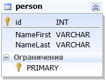

# dBEAR Sample 01

One entity (Person) with 2 attributes (NameFirst & NameLast) defined in one namespace (com.flancer32.dbear.sample.core). 

## Domain Entities Map

* [XML](sample_01.dem.xml)
* [JSON](sample_01.dem.json)

## Database Structure

[SQL](sample_01.sql)