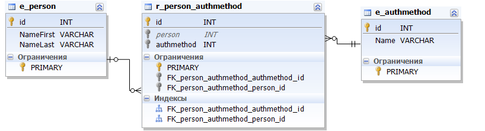

# dBEAR Sample 02

* Add attribute 'Gender' to entity 'Person' from namespace 'com.flancer32.dbear.sample.core'.
* Add new namespace 'com.flancer32.dbear.sample.auth':
    * with entity 'AuthMethod' (one attribute: 'Name');
    * and relation 'Person_AuthMethod' between 'com.flancer32.dbear.sample.core.Person' and 'com.flancer32.dbear.sample.auth.AuthMethod';

## Domain Entities Map

* [XML](sample_02.dem.xml)
* [JSON](sample_02.dem.json)

## Database Structure

[SQL](sample_02.sql)